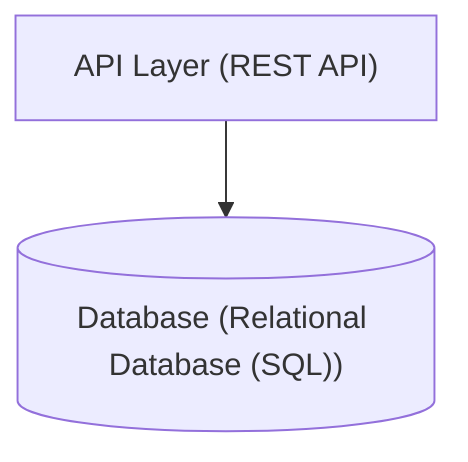

# Architecture Document — repolens

## 1. High-Level Architecture
### Modular CLI Application
Confidence: **90%**

**Evidence:**
- Command line entrypoint and CLI structure

## 2. Visual Architecture Diagram
### ASCII Diagram
```text
┌───────────────────────────────────┐
│  API Layer: API / Routing Layer   │
└─────────────────┬─────────────────┘
                  │
                  ↓
┌───────────────────────────────────┐
│  Database: Relational Database (SQL)│
└───────────────────────────────────┘
```

### Mermaid Diagram


## 3. Entry Points & Control Flow
- **`pyproject.toml`** (cli): Declared console script 'repolens' in pyproject.toml
- **`src/repolens/detectors/entrypoint.py`** (web_application): Instantiates FastAPI application
- **`tests/integration/test_fixtures.py`** (web_application): Instantiates FastAPI application
- **`tests/unit/test_parsers.py`** (web_application): Instantiates FastAPI application
- **`tests/unit/test_detectors.py`** (web_application): Instantiates FastAPI application
- **`src/repolens/cli/main.py`** (executable_script): Python executable block (if __name__ == '__main__':)

## 4. Persistence Architecture
- **Engine**: `Relational Database (SQL)`
- **ORM/Driver**: `ORM`
- **Entities**: DiscoveredEndpoint, EntryPointInfo, LLMResponse, AnalysisConfig, ParsedFunction, ArchitectureFinding, ValidationReport, SecurityFinding, EnvVarInfo, RepoLensConfig, SecurityConfig, FindingEvidence, GraphNode, DirectoryMetadata, ConfidenceScore, MonorepoInfo, AIConfig, EvidenceRecord, OutputConfig, SearchResult, ProjectCommandsInfo, AgentResponse, CICDInfo, ParsedImport, ProjectConfig, ArchitecturalConcern, ParsedClass, ParsedSource, StructuredCodebaseContext, DatabaseInfo

## 5. Potential Architectural Concerns & Smells
- No major architectural violations detected.