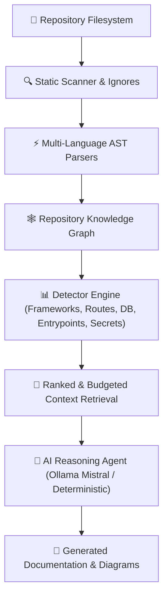

<div align="center">

# 🔍 RepoLens

### **Autonomous Codebase Intelligence & Architecture Agent**

*Turn any unfamiliar codebase into a complete engineering map with a single command.*

[](https://python.org)
[](https://opensource.org/licenses/MIT)
[](#-running-tests)
[](#-cross-platform)
[](#-local-ai-setup-with-ollama)

<br/>

```bash
git clone https://github.com/kunal-yelgate/repolens.git
cd repolens
pip install -e .

# Understand any repository instantly:
repolens analyze
```

<br/>

[Quick Start](#-quick-start) • [Key Features](#-key-features) • [How It Works](#-how-it-works) • [Commands](#-cli-command-reference) • [Ollama Setup](#-local-ai-setup-with-ollama) • [Generated Docs](#-generated-documentation)

</div>

---

> [!TIP]
> **Zero Hallucination Guarantee**: RepoLens builds a deterministic static AST Knowledge Graph first. Every architecture claim, route endpoint, database model, and file dependency is verified with exact line numbers before AI reasoning.

---

## ⚡ Why RepoLens?

When developers open a new repository, onboarding takes hours or days:
* ❓ *What does this project do and what is the tech stack?*
* ❓ *Where does execution start and how do components connect?*
* ❓ *Where are the API endpoints, database models, and secret variables?*
* ❓ *How do I set up the environment, run dev servers, and execute tests safely?*

**RepoLens solves this in seconds.**

```text
Clone Repository ──> repolens analyze ──> Complete Architectural Map & Docs
```

---

## ✨ Key Features

| Feature | Description |
| :--- | :--- |
| **🔍 Multi-Language AST Parsing** | Parses Python, JS/TS, Go, Rust, Java, C/C++, PHP, Ruby, Kotlin, Swift, and Shell source trees. |
| **🕸️ Repository Knowledge Graph** | Builds a directed dependency graph using NetworkX to map module coupling and detect circular dependencies. |
| **🗺️ Entry Point & Route Discovery** | Detects application entry points and REST/HTTP endpoints across FastAPI, Express, React, Next.js, Flask, Gin, and Spring Boot. |
| **🛢️ Persistence & Schema Analysis** | Identifies PostgreSQL, MySQL, SQLite, MongoDB, and Redis along with SQLAlchemy, Prisma, Mongoose, and Django ORM models. |
| **🛡️ Secret Leak & Security Scanner** | Detects hardcoded keys, tokens, and static vulnerabilities with **automatic secret string redaction**. |
| **🧪 Autonomous Test Runner** | Safely runs test suites, captures stdout/stderr, analyzes failures, and provides step-by-step fix recommendations. |
| **🛠️ Interactive Setup Assistant** | Checks runtimes, verifies missing `.env` variables, and prompts confirmation before installing dependencies. |
| **🔒 100% Privacy & Offline First** | Operates without sending code off your machine, with full offline deterministic static mode support. |
| **🦙 Local AI (Ollama Mistral)** | Integrated with local Ollama (`mistral`) or cloud LLMs (OpenAI, Anthropic, Gemini, Groq). |

---

## 🏗️ How It Works

RepoLens follows a deterministic static-analysis pipeline rather than sending raw code dumps to LLMs:



---

## 🖥️ Terminal Experience

When you run `repolens analyze`:

```text
RepoLens
Autonomous Codebase Intelligence Agent

Repository: C:\Projects\my-app

Scanning repository...

✓ Repository detected
✓ Languages detected: Python (52.3%), TypeScript (31.4%), JavaScript (16.3%)
✓ Frameworks detected: FastAPI, React, Vite, SQLAlchemy
✓ Dependencies analyzed (83 files)
✓ Entry points detected (2 entry points)
✓ Configuration analyzed (5 env vars)
✓ Architecture reconstructed (Full-Stack Client-Server)
✓ Tests detected (pytest)
✓ Documentation generated

==================================================
CODEBASE SUMMARY
==================================================
Project: my-app
Type: Full-stack web application
Languages: Python, TypeScript, JavaScript
Frameworks: FastAPI, React, Vite, SQLAlchemy
Architecture: Full-Stack (Client-Server / REST API)
Database: PostgreSQL (SQLAlchemy)
Main Entry Points:
  • frontend/src/main.jsx (React / Web client UI root mount)
  • backend/app/main.py (Instantiates FastAPI application)
Tests: pytest (backend/tests/)

==================================================
PROJECT COMMANDS
==================================================
Install:
  Backend:  pip install -r backend/requirements.txt
  Frontend: npm install

Development:
  Backend:  uvicorn app.main:app --reload
  Frontend: npm run dev

Testing:    pytest

==================================================
ARCHITECTURE
==================================================
┌───────────────────────────────────┐
│  Frontend: React                  │
└─────────────────┬─────────────────┘
                  │ HTTP / WebSocket
                  ↓
┌───────────────────────────────────┐
│  API Layer: FastAPI               │
└─────────────────┬─────────────────┘
                  │
                  ↓
┌───────────────────────────────────┐
│  Database: PostgreSQL             │
└───────────────────────────────────┘

==================================================
Generated Documentation:
  ✓ REPOLENS.md -> ./REPOLENS.md
  ✓ ARCHITECTURE.md -> ./ARCHITECTURE.md
  ✓ SETUP.md -> ./SETUP.md
  ✓ TESTING.md -> ./TESTING.md
  ✓ API.md -> ./API.md
  ✓ ONBOARDING.md -> ./ONBOARDING.md
==================================================
```

---

## 🚀 Quick Start

### 1. Installation

```bash
git clone https://github.com/kunal-yelgate/repolens.git
cd repolens

pip install -e .
```

### 2. Run Analysis

Navigate to any project directory and execute:

```bash
repolens analyze
```

Large repositories are scanned with file-size and depth limits, and RepoLens shows
live progress while it works. Files above `analysis.max_file_size` remain visible
in the inventory but are not loaded for parsing; the result reports how many were
skipped. Adjust `analysis.max_file_size` / `analysis.max_depth` in `repolens.toml`,
or use `repolens analyze --max-file-size 1000000 --depth 25` to include larger or
more deeply nested source files.

---

## 🦙 Local AI Setup with Ollama (Mistral)

RepoLens is built for privacy and performance. You can power AI reasoning locally using **Ollama** with the **Mistral** model.

### 1. Pull the Mistral Model

```bash
ollama pull mistral
```

### 2. Configure RepoLens

```bash
repolens config --provider ollama --model mistral
```

### 3. Verify Local AI Connection

```bash
repolens doctor
```

Output:
```text
RepoLens Doctor

✓ Python 3.13.7
✓ Git
✓ Node.js (v22.23.1)
✓ npm
✓ Docker
✓ Project structure analyzed
✓ Environment variables configuration
✓ AI Provider (ollama / mistral)
```

---

## 📖 CLI Command Reference

| Command | Usage | Description |
| :--- | :--- | :--- |
| `analyze` | `repolens analyze` | Deep-scan repository, reconstruct architecture, and generate markdown docs. |
| `doctor` | `repolens doctor` | Check runtimes (Python, Node, Docker), project dependencies, and env variables. |
| `ask` | `repolens ask "<question>"` | Ask codebase questions or find where to make specific code changes. |
| `explain` | `repolens explain "[topic]"` | Explain overall architecture, component relationships, or data flows. |
| `find` | `repolens find "<term>"` | Perform ranked codebase search across files, routes, classes, and functions. |
| `graph` | `repolens graph --file <path>` | Visualize module dependency graph and incoming/outgoing imports. |
| `test` | `repolens test` | Safely execute test suite, capture output, analyze failures, and suggest fixes. |
| `setup` | `repolens setup` | Interactive setup assistant to verify runtimes and install dependencies. |
| `security` | `repolens security` | Scan for hardcoded secrets, tokens, and static code vulnerabilities with redaction. |
| `api` | `repolens api` | List all discovered REST & HTTP API endpoints across backend frameworks. |
| `git` | `repolens git` | Inspect Git commit history, active branch, and development hotspots. |
| `onboarding` | `repolens onboarding` | Generate standalone developer onboarding guide (`ONBOARDING.md`). |
| `config` | `repolens config --provider <p>` | View or update RepoLens settings and AI providers. |
| `init` | `repolens init` | Initialize `repolens.toml` and `.repolensignore` in the current repository. |

---

## 📄 Generated Documentation Suite

Running `repolens analyze` automatically generates 6 structured Markdown reports:

- 📑 [`REPOLENS.md`](file:///c:/Users/yelga/Desktop/repolens/REPOLENS.md) — **Executive Overview**: Technology stack, directory tree, entry points, commands, and architecture diagrams.
- 🏛️ [`ARCHITECTURE.md`](file:///c:/Users/yelga/Desktop/repolens/ARCHITECTURE.md) — **System Architecture**: Component breakdown, persistence layer, control flow, and architectural concerns.
- ⚙️ [`SETUP.md`](file:///c:/Users/yelga/Desktop/repolens/SETUP.md) — **Setup & Execution**: Prerequisites, environment variables table, installation steps, and launch commands.
- 🧪 [`TESTING.md`](file:///c:/Users/yelga/Desktop/repolens/TESTING.md) — **Testing Guide**: Frameworks, test directories, run-all commands, and single-test execution templates.
- 🔌 [`API.md`](file:///c:/Users/yelga/Desktop/repolens/API.md) — **API Reference**: Formatted table of HTTP methods, route paths, handlers, frameworks, and auth status.
- 🚀 [`ONBOARDING.md`](file:///c:/Users/yelga/Desktop/repolens/ONBOARDING.md) — **Developer Onboarding**: 10-step guide for new engineers contributing to the project.

---

## ⚙️ Configuration (`repolens.toml`)

Customize scan parameters in `repolens.toml`:

```toml
[project]
name = "my-project"

[analysis]
max_file_size = 500000
max_depth = 15
incremental = true

[ai]
provider = "ollama"
model = "mistral"

[security]
scan_secrets = true
scan_vulnerabilities = true

[output]
directory = "."
format = "markdown"
```

---

## 🧪 Running Tests

RepoLens includes a complete test suite with unit tests, fixture integration tests, and self-analysis tests:

```bash
pytest
```

Output:
```text
============================= 15 passed in 3.23s ==============================
```

---

## 🤝 Contributing

Contributions are welcome! Please check out [CONTRIBUTING.md](file:///c:/Users/yelga/Desktop/repolens/CONTRIBUTING.md) and our [CODE_OF_CONDUCT.md](file:///c:/Users/yelga/Desktop/repolens/CODE_OF_CONDUCT.md).

---

## 📜 License

Distributed under the **MIT License**. See [LICENSE](file:///c:/Users/yelga/Desktop/repolens/LICENSE) for details.

<div align="center">
  <sub>Built with ❤️ by the RepoLens Team. Designed for developers everywhere.</sub>
</div>
