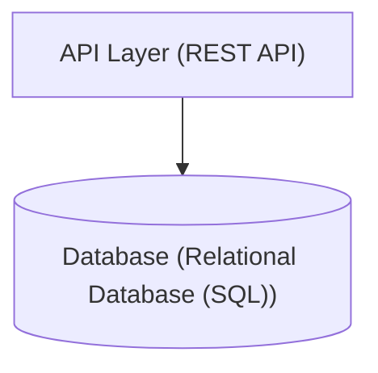

# repolens — Codebase Intelligence

> Generated automatically by **RepoLens** autonomous codebase analysis agent.

## 1. Project Overview
- **Project Name**: `repolens`
- **Type**: CLI tool
- **Files**: 95 files (6546 total lines of code)
- **Version Control**: Non-git directory

## 2. Technology Stack
### Languages
- **Python**: 100.0%

### Frameworks & Libraries
- Pydantic
- Typer
- pytest

## 3. Repository Structure
```text
repolens/
├── .repopilot/
│   ├── index.json
├── docs/
│   ├── ai.md
│   ├── architecture.md
│   ├── cli.md
│   ├── detectors.md
├── src/
│   ├── repolens/
│   │   ├── __init__.py
├── tests/
│   ├── integration/
│   │   ├── test_fixtures.py
│   │   ├── test_self_analysis.py
│   ├── unit/
│   │   ├── test_detectors.py
│   │   ├── test_ignore.py
│   │   ├── test_knowledge_graph.py
│   │   └── ... (3 more files)
├── pyproject.toml
├── repolens.toml
├── API.md
├── ARCHITECTURE.md
├── CHANGELOG.md
├── CONTRIBUTING.md
├── README.md
├── SETUP.md
├── CODE_OF_CONDUCT.md
├── LICENSE
├── ONBOARDING.md
├── REPOPILOT.md
├── SECURITY.md
└── TESTING.md
```

## 4. High-Level Architecture
- **Modular CLI Application** (Confidence: 90%)
  - Evidence: Command line entrypoint and CLI structure

```text
┌───────────────────────────────────┐
│  API Layer: API / Routing Layer   │
└─────────────────┬─────────────────┘
                  │
                  ↓
┌───────────────────────────────────┐
│  Database: Relational Database (SQL)│
└───────────────────────────────────┘
```

## 5. Main Entry Points
- `pyproject.toml`: Declared console script 'repolens' in pyproject.toml *(Confidence: 95%)*
- `src/repolens/detectors/entrypoint.py`: Instantiates FastAPI application *(Confidence: 95%)*
- `tests/integration/test_fixtures.py`: Instantiates FastAPI application *(Confidence: 95%)*
- `tests/unit/test_parsers.py`: Instantiates FastAPI application *(Confidence: 95%)*
- `tests/unit/test_detectors.py`: Instantiates FastAPI application *(Confidence: 95%)*
- `src/repolens/cli/main.py`: Python executable block (if __name__ == '__main__':) *(Confidence: 85%)*

## 6. Database & Persistence
- **Technology**: `Relational Database (SQL)`
- **ORM**: `ORM`
- **Models / Schemas**: `DiscoveredEndpoint`, `EntryPointInfo`, `LLMResponse`, `AnalysisConfig`, `ParsedFunction`, `ArchitectureFinding`, `ValidationReport`, `SecurityFinding`, `EnvVarInfo`, `RepoLensConfig`, `SecurityConfig`, `FindingEvidence`, `GraphNode`, `DirectoryMetadata`, `ConfidenceScore`

## 7. Environment Variables
- `ANTHROPIC_API_KEY` (Required) — Used by: `src/repolens/ai/factory.py`, `src/repolens/config/loader.py`
- `GEMINI_API_KEY` (Required) — Used by: `src/repolens/ai/factory.py`, `src/repolens/config/loader.py`
- `GROQ_API_KEY` (Required) — Used by: `src/repolens/ai/factory.py`, `src/repolens/config/loader.py`
- `OPENAI_API_KEY` (Required) — Used by: `src/repolens/ai/factory.py`, `src/repolens/config/loader.py`
- `OPENAI_BASE_URL` (Required) — Used by: `src/repolens/config/loader.py`
- `REPOLENS_API_KEY` (Required) — Used by: `src/repolens/config/loader.py`
- `REPOLENS_BASE_URL` (Required) — Used by: `src/repolens/config/loader.py`
- `REPOLENS_LLM_PROVIDER` (Required) — Used by: `src/repolens/config/loader.py`
- `REPOLENS_MODEL` (Required) — Used by: `src/repolens/config/loader.py`
- `REPOLENS_PROVIDER` (Required) — Used by: `src/repolens/config/loader.py`

## 8. Setup & Development Commands
### Install Dependencies
**Python**:
```bash
pip install -e .
```

### Run Development Server
**Python**:
```bash
python -m repolens analyze
```

### Run Test Suite
**Python**:
```bash
pytest
```

## 9. CI/CD & Infrastructure
- **CI/CD Platform**: None detected
- **Docker Support**: No
- **Docker Compose**: No
- **Kubernetes**: No
- **Terraform**: No

## 10. Potential Architectural Concerns
- No critical architectural smells detected.

## 11. Architecture Diagram


---
*Analysis generated on 2026-10-03 23:36:21*